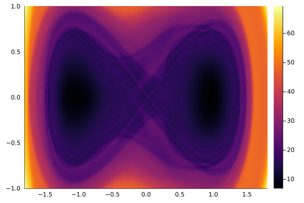
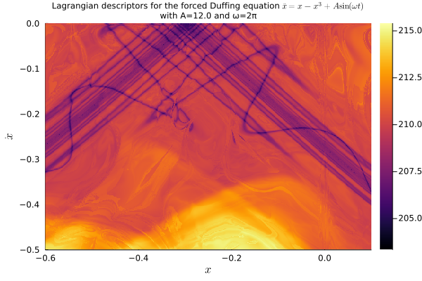

# Lagrangian Descriptors

Implementation of the method of **Lagrangian Descriptors** to highlight singular features (e.g. stable or unstable invariant manifolds) of the dynamics of an evolutionary system (such as ordinary or partial differential equations, random equations, or stochastic differential equations).

Here are some examples on a periodically forced Duffing system.





## Current state

Handling of problems of the type `ODEProblem` is essentially done. It is just missing the plot recipe.

What we have so far:

1. A method `augmentprob(prob::ODEProblem, M; view=:both)` that takes an `ODEProblem` and a local Lagrangian descriptor `M=M(du, u, p, t)` and creates another `ODEProblem` for an augmented system which contains for components: the original forward ODE problem, the associated backward ODE problem, and the equations for the forward and backward Lagrangian descriptors. If `view=:forward`, then the augmented system only contains the forward equation and the forward Lagrangian descriptor. If `view=:backard`, then the augmented system only contains the backward equation and the backward Lagrangian descriptor.
1. The given `ODEProblem` can be in-place or out-of-place, but the augmented system is always in-place, and the components are build using `ComponentArrays`, with componentes `fwd` (forward ODE), `bwd` (backward ODE), `lfwd` (forward Lagrangian descriptor), `lbwd` (backward Lagrangian descriptor).
1. A type and a method constructor `LagrangianDescriptorProblem(prob, M, uu0; direction::Symbol=:both)` that takes the original problem `prob`, the local Lagrangian descriptor `M`, a collection of initial conditions `uu0` (e.g. a vector, array, range or anything with a `length` and accessible by index `uu0[i]`), and the optional keyword `direction`. The arguments `prob`, `M` and `direction` are simply passed to `augmentprob(prob, M; view)` for the creation of an aumented problem `augprob`. Then, an `EnsembleProblem` is created with `augprob` and including a `prob_func` that is supposed to sweep the initial conditions in `uu0` and an `output_func` that is supposed to only save the last element (at time `final(tspan)`) of the foward and backward Lagrangian descriptors. They are then used to create an instance `lagprob` of the `LagrangianDescriptorProblem` that contains two fields, `lagprob.ensprob` being the associated ensemble problem and `lagprob.uu0` being the collection of initial conditions.
1. Finally, a dispatch of `solve(lagprob::LagrangianDescriptorProblem, alg, args...; kwargs...)` that solves the ensemble problem `lagprob.ensprob` with `trajectories=length(uu0)` and whatever algoritm and arguments/keyword arguments is necessary or desired.

What is currently missing:
1. A proper solution type for the result of solving the Lagrangian descriptor problem. Currently, it returns an `EnsembleSolution`. We should have a proper `LagrangianDescriptorSolution` that would include the `EnsembleSolution` as one of its fields and whatever else seems suitable.
1. A plot recipe;
1. Lots of tests;
1. Proper documentation;
1. Support for other types of problems, e.g. `SDEProblem`, `RODEProblem`, mixed differential-algebraic equations, etc.;
1. I don't know whether/how the idea applies to delay type equations, but we should check that out.
1. Register the package.

## Implementation

Here are the two initial ideas for implementing such method. We ended up implementing the first one.

### Augmenting the system

We augment the system and compute the descriptors along with the solution.

1. One builds a problem `prob` of a given type from `SciMLBase.jl`, say an `ODEProblem` for `du/dt = f(u, p, t)`.
2. Then we pass it to `ldprob = LagrangianDescriptorProblem(prob, M, uu)`, where `M = M(du, u, p, t)` is the (infinitesimal) descriptor, which is a scalar function, e.g. `M(du, u, p, t) = norm(du)`, and `uu` is some iterator with a collection of initial conditions (e.g. an `Array` for a mesh in phase space or a portion of a sub-manifold of the phase space). 
3.  `LagrangianDescriptorProblem` uses `prob.f` and `prob.tspan` to create, via `ComponentArrays`,  a new `ODEProblem` for an augmented system of the form

$$
\begin{cases}
\displaystyle \frac{du}{dt} = f(u, p, t) \\ \\
\displaystyle \frac{dv}{dt}  = -f(v, p, 2t_0-t) \\ \\
\displaystyle \frac{dL_f}{dt}  = M(u, p, t) \\ \\
\displaystyle \frac{dL_b}{dt}  = M(v, p, t) \\
\end{cases}
$$

5. Notice $v$ solves the system backwards. If `tspan = (t0, tf)`, then $v$ solves it backwards in the interval `(2t0 - tf, t0) = (t0 - (tf - t_0), t_0)`. So, we solve the system forwards and backwards at the same time.
6. The forward and backward Lagrangian descriptors `L_f` and `L_b` are the forward and backward integrations of the infinitesimal descriptor `M`.
7. Then, solving an `LagrangianDescriptorProblem` works via an `EnsembleProblem`, where at each new solve, a new initial condition is picked.
8. At the end of each of those solves, we only need to save the values of `Lf[end]` and `Lb[end]`.
9. We can visualize the Lagrangian descriptor using a heatmap of `Lf[end]`, `Lb[end]` or `Lf[end] + Lb[end]`.
10. We can also add a flag to build only the forward descriptor `Lf` or the backward descriptor `Lb`.

### Post-processing 

Alternatively, instead of augmenting the system and computing the descriptor along the solutions, we can just solve an ensemble of solutions of the original system and then integrate the descriptor over each solution.

This is simpler, *but* it has potential drawbacks:

1. First, we will need to save each trajectory in full, instead of only `Lf[end]` and `Lb[end]`, so this is more memory demanding. Keep in mind we need to solve for a lot of trajectories.

2. Secondly, some solutions may have some spread out time steps. We either have to force it to save on a fine time mesh, for better time integration, or we use the interpolation present in the solution, which might be slower to compute.

~~Anyway, the plan is to implement both approaches and do some performance comparisons. Maybe we keep both methods and leave a flag to choose between the two.~~

I have decided against implementing this post-processing approach. As I guessed, this would be computationally demanding, as seen in the following benchmark:
```zsh
[ Info: Create forward ODE problem:
  10.083 μs (108 allocations: 5.00 KiB)
[ Info: Remake for backward ODE problem:
  1.708 ns (0 allocations: 0 bytes)
[ Info: Solve forward ODE problem:
  9.556 μs (138 allocations: 14.95 KiB)
[ Info: Solve backward ODE problem:
  9.514 μs (138 allocations: 14.95 KiB)
[ Info: Create augmented ODE problem:
  16.209 μs (175 allocations: 8.41 KiB)
[ Info: Solve Augmented ODE problem:
  23.625 μs (249 allocations: 32.25 KiB)
[ Info: Postprocessing for forward Lagrangian descriptor:
  68.125 μs (886 allocations: 85.62 KiB)
[ Info: Postprocessing for backward Lagrangian descriptor:
  31.834 μs (405 allocations: 39.30 KiB)
```

We already see that solving both forward and backward equations separately takes longer than solving the augmented system with both forward and backward evolutions *and* including the computations of the Lagrangian descriptors. Worse than that, for post-processing each separate forward and backward evolutions to find the Lagrangian descriptors for them takes an even much longer time. And this was done for a single trajectory. Imagine for the ensemble of solutions, on top of the memory demand. It is not worth it. I will include a separate "post-processing" method for the sake of debugging, development, and comparison, but it will not be part of the main API.

## References

* [Painting the Phase Portrait of a Dynamical System with the Computational Tool of Lagrangian Descriptors](https://www.ams.org/journals/notices/202206/noti2489/noti2489.html?adat=June/July%202022&trk=2489&galt=none&cat=feature&pdfissue=202206&pdffile=rnoti-p936.pdf)
* [Lagrangian descriptors: A method for revealing phase space structures of general time dependent dynamical systems](https://www.sciencedirect.com/science/article/abs/pii/S1007570413002037)
* [Frequently Asked Questions about Lagrangian Descriptors](https://acp.copernicus.org/preprints/acp-2016-633/acp-2016-633-SC2-supplement.pdf)

