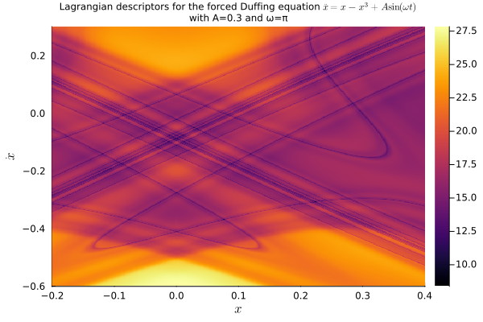

# LagrangianDescriptors.jl documentation

## Overview

The dynamics of evolutionary systems can be quite intricate. The method of **Lagrangian Descriptors** helps to visualize the complicate behavior of such systems. In a recent article, Wiggins and and García-Garrido call it *painting the phase portrait* (of a dynamical system) (see [S. Wiggins and V. J. García-Garrido, Painting the Phase Portrait of a Dynamical System with the Computational Tool of Lagrangian Descriptors (AMS Notices, June/July 2022)](https://www.ams.org/journals/notices/202206/noti2489/noti2489.html?adat=June/July%202022&trk=2489&galt=none&cat=feature&pdfissue=202206&pdffile=rnoti-p936.pdf).

The method is akin to droping colored ink in a fluid flow and seeing the dye being transported to reveal the flow patterns, except that the color don't get diffused as in a real fluid.

The image below, for instance, shows the dynamics of the following periodically-forced Duffing equation,

```math
\ddot x = x - x^3 + A\sin(\omega t),
```

with a particular combination of parameters and near time $t=0$.

With `LagrangianDescriptors.jl`, the image can be obtained by first setting up the equation as an `ODEProblem` from `SciML/DifferentialEquations`, then wrapping that as a `LagrangianDescriptorProblem` from `LagrangianDescriptors.jl`, and finally solving it and plotting the result with the builtin plot recipe.

So we first load the relevant packages:

```@example duffing
using OrdinaryDiffEq, Plots
using LinearAlgebra: norm
using LagrangianDescriptors
```

Next we set up the `ODEProblem`:

```@example duffing
function f!(du, u, p, t)
    x, y = u
    A, ω = p
    du[1] = y
    du[2] = x - x^3 + A * cos(ω * t)
end

u0 = [0.5, 2.2]
tspan = (0.0, 13.0)
A = 0.3; ω = π; p = (A, ω)

prob = ODEProblem(f!, u0, tspan, p)
```

With the ODE problem setup, we choose an infinitesimal Lagrangian descriptor and build the `LagrangianDescriptorProblem`:

```@example duffing
M(du, u, p, t) = norm(du)

uu0 = [[x, y] for y in range(-1.0, 1.0, length=301), x in range(-1.8, 1.8, length=301)]

lagprob = LagrangianDescriptorProblem(prob, M, uu0)
```

The Lagrangian descriptors are the time-integration of the infinitesimal descriptor along forward and backward solutions of the equation. They are integrated along with the solutions by "solving" the `LagrangianDescriptorProblem`, with an overload of the `solve` method from the [SciML](https://sciml.ai) ecosystem:

```@example duffing
lagsol = solve(lagprob, Tsit5())
```

With the solution at hand, we plot the Lagrangian descriptors to visualize the dynamics of the system:

```@example duffing
plot(lagsol, title="Lagrangian descriptors for the forced Duffing equation \$\\ddot x = x - x^3 + A\\sin(\\omega t)\$\nwith A=$A and ω=$ω", titlefont=8, xlabel="\$x\$", ylabel="\$\\dot x\$")

savefig("img/duffing.png"); nothing # hide
```


We may zoom closer to the origin to find the following "painting":

```@example duffing
uu0 = [[x, y] for y in range(-0.6, 0.3, length=501), x in range(-0.2, 0.4, length=501)]
lagprob = LagrangianDescriptorProblem(prob, M, uu0)

lagsol = solve(lagprob, Tsit5());

plot(lagsol, title="Lagrangian descriptors for the forced Duffing equation \$\\ddot x = x - x^3 + A\\sin(\\omega t)\$\nwith A=$A and ω=$ω", titlefont=8, xlabel="\$x\$", ylabel="\$\\dot x\$")

savefig("img/duffing2.png")
```



## Developers

LagrangianDescriptors is currently being developed by [Ricardo M. S. Rosa](https://rmsrosa.github.io), but contributors are welcome.

## Cite
