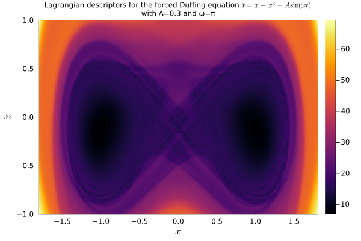

# LagrangianDescriptors.jl documentation

## About

The dynamics of evolutionary systems can be quite intricate. The method of **Lagrangian Descriptors** helps to visualize the complicate behavior of such systems and to make sense of it. In a recent article, Wiggins and and García-Garrido call it [a method for] *painting the phase portrait* (of a dynamical system) (see [S. Wiggins and V. J. García-Garrido, Painting the Phase Portrait of a Dynamical System with the Computational Tool of Lagrangian Descriptors (AMS Notices, June/July 2022)](https://www.ams.org/journals/notices/202206/noti2489/noti2489.html?adat=June/July%202022&trk=2489&galt=none&cat=feature&pdfissue=202206&pdffile=rnoti-p936.pdf).

The image below, for instance, shows the dynamics of a periodically-forced Duffing equation, with a particular combination of parameters and near time $t=0$ (see [Tutorial: Periodically-forced Duffing equation](tutorial_ODEs.md#Periodically-forced-Duffing-equation)):



## Method

The method is akin to droping colored ink in a fluid flow, tracking the dye as it is transported by the flow, and revealing the pattern created after a certain period of time. The difference being that the color doesn't get diffused as in a real fluid, so the image doesn't get blurred and one gets a clearer picture.

It is similar to drawing a phase portrait, which displays a collection of orbits, but in this method each orbit is painted according to its dynamic behavior, better revealing the overall picture.

This "coloring" is obtained by integrating a **local,** or **infinitesimal descriptor** $M=M(t, u)$ along a solution $u=u(t)$ of the system. One common choice for the infinitesimal descriptor is the velocity of the trajectory, so that, upon integration along the solution over a given period of time, the Lagrangian descriptor becomes the arc-length of that portion of the solution. Depending on whether the solution is at a fixed point, or belongs to a stable or unstable manifold, and so on, the arc-length would be closer for solutions with similar behavior, revealing the common patterns of the dynamics.

Thus, if $u=u(t)$ is a solution over a time span $(t_0, t_f)$, with $t_f > t_0$, then the **forward Lagrangian descriptor** is given by

```math
L_{\mathrm{fwd}} = \int_{t_0}^{t_f} M(t, u(t)) \;\mathrm{d}t.
```

If $t_f < t_0$, so that $u=u(t)$ is a "backward" solution from $t_0$, then we obtain the **backward Lagrangian descriptor**

```math
L_{\mathrm{bwd}} = \int_{t_f}^{t_0} M(t, u(t)) \;\mathrm{d}t = - \int_{t_0}^{t_f} M(t, u(t)) \;\mathrm{d}t.
```

Since the system might be non-autonomous, these Lagragians descriptors are referred as descriptors **near ``t_0``**.

## Approach

Notice the computation of the Lagrangian descriptors only depend on a given solution and on the infinitesimal descriptor, so that they can be computed *a posteriori*. However, this is not the most efficient way of computing them. For a more efficient implementation, one writes the integrals for the Lagrangian descriptors as differential equations, i.e.

```math
\frac{\mathrm{d}L_{\mathrm{fwd}}}{\mathrm{d}t} = M(t, u(t))
```
and similarly for the backward Lagrangian descriptor. Then, one solves the (partially) coupled system to obtain the integrated descriptor.

More explicitly, when both forward and backward Lagrangians are desired, we may write a four-component system for solving both the backward and forward solutions and the backward and forward Lagrangians at the same time:

```math
\begin{cases}
  \displaystyle \frac{\mathrm{d}u}{\mathrm{d}t} = f(u, t), \\ \\
  \displaystyle \frac{\mathrm{d}v}{\mathrm{d}t} = -f(v, 2t_0 - t), \\ \\
  \displaystyle \frac{\mathrm{d}L_{\mathrm{fwd}}}{\mathrm{d}t} = M(u, t), \\ \\
  \displaystyle \frac{\mathrm{d}L_{\mathrm{bwd}}}{\mathrm{d}t} = M(v, 2t_0 - t),
\end{cases}
```
with the set of initial conditions
```math
u(t_0) = v(t_0) = u_0, \quad L_{\mathrm{fwd}}(t_0) = L_{\mathrm{bwd}}(t_0) = 0.
```

For a given time interval ``(t_0, t_f)``, with ``t_f > t_0``, notice that ``u=u(t)`` solves the system forward, over the interval ``(t_0, t_f)``, while ``v=v(t)`` solves the system backward, over the interval ``(2t_0 - t_f, t_0) = (t_0 - (t_f - t_0), t_0)``, both with the same initial condition ``u_0``, i.e. the compute the forward and backward parts of the same trajectory, over the same length of time, but in different directions.

## Implementation

The API is simple, it amounts to building a `LagrangianDescriptorProblem`, solving it and plotting the solution:

```julia
lagprob = LagrangianDescriptorProblem(prob, M, uu0)
lagsol = solve(lagprob, alg)
plot(lagsol)
```

where `prob` is a given problem, such as an `ODEProblem`; `M` is the infinitesimal Lagrangian descriptor; `uu0` is a collection of initial conditions; and `alg` is the algorithm chosen to solve the `ODEProblem`, such as `Tsit5()`.

More precisely, the implementation works as follows:

1. One builds a *differential equation problem* `prob` of a type defined in `SciMLBase.jl`, from [SciML/DifferentialEquations.jl](https://github.com/SciML/DifferentialEquations.jl), say an `ODEProblem` for ``\mathrm{d}u/\mathrm{d}t = f(u, p, t)`` (in-place or out-of-place). 
1. One chooses an *infinitesimal descriptor* of the form `M=M(du, u, p, t)` (or other form suitable to the given problem type), with scalar values, that will be integrated along a solution ``u(t) = u(t; u_0)``, to yield the forward Lagrangian descriptor ``L_{\mathrm{fwd}}(u_0)`` and the backward Lagrangian descriptor ``L_{\mathrm{bwd}}(u_0)``, for a given initial condition ``u_0``.
1. One chooses a collection `uu0` of initial conditions (e.g. a `Vector`, or a more general `Array` or any iterator, with the elements of the collection being suitable initial conditions for the given problem), representing a mesh in phase space or a portion of a sub-manifold of the phase space to be "painted" by the method.
1. Then we pass them to `lagprob = LagrangianDescriptorProblem(prob, M, uu0)`, to create the associated *Lagrangian descriptor problem* `lagprob`.
    1. `LagrangianDescriptorProblem` uses `prob.f`, `prob.p`, `prob.u0`, `prob.tspan`, and any `prob.kwargs` to create, via `ComponentArrays`, a new problem (e.g. a new `ODEProblem`) for the *augmented system*.
    1. The *augmented* problem has, by default, four components, for solving the original equation forward and backward in time, and for solving the Lagrangian descriptors forward and backward in time. The way the augmented systems is constructed is via [ComponentArrays.jl](https://github.com/jonniedie/ComponentArrays.jl), so the augmented system is a `ComponentVector`, with components `fwd`, `bwd`, `lfwd`, and `lbwd`, respectively.
    2. One may choose the keyword `direction = :forward` or `direction = :backward` to build the augmented system in only one direction, with the default being `direction = :both`.
    1. `LagrangianDescriptorProblem` then wraps an [EnsembleProblem](https://diffeq.sciml.ai/dev/features/ensemble/) for the augmented system and with the given collection `uu_0` of initial conditions to be used at each trajectory of the ensemble;
1. Solve the `LagrangianDescriptorProblem` by invoking `lagsol = solve(lagprob, alg, args..., kwargs...)`, with the appropriate algorithm and any other argument for the ensemble solve of the underlying ensemble problem `lagprob.ensprob`. 
1. `solve` returns a `LagrangianDescriptorSolution` containing the associated collection of (forward and backward) Lagrangian descriptor values at the final time of each simulation (which is ``t_f`` for the forward components and corresponds to ``2t_0 - t_f`` for the backward ones). This solution has the following fields:
    1. `enssol`: the `EnsembleSolution` of the associated ensemble problem, where `enssol.u` contains a vector with the component arays `lfwd` and `lbwd` (or only one of them, depending on the `direction`) for the Lagrangian descriptors at the final time of the simulation (i.e. ``t_f`` for the forward Lagrangian and ``2t_0 - t_f`` for the backward);
    1. `uu0`: the given collection of initial conditions;
    1. `direction`: the direction chosen, which defaults to `:both`, but can be also `:forward` or `:backward`.
1. Finally, one can use `plot` to visualize either the forward, or the backward, or the sum (total), or even the difference, of the forward and backward Lagrangian descriptor, via a plot recipe for the `LagrangianDescriptorSolution`, i.e. by calling `plot(lagsol)` or `plot(lagsol, direction)`, where `direction` is either `:forward`, `:backward`, `:total` or `:difference`.

## Current state

The package is still in an embrionary phase and currently accepts differential equations of the type `ODEProblem`. Problems like `SDEProblem` and `RODEProblem` will be implemented soon. Other problems will come eventually.

The plot recipe works for some types of collections of initial conditions (e.g. a `AbstractVector{<:Number}`, for scalar problems, and `AbstractMatrix{<:AbstractVector{<:Number}}` with the `AbstractVector` of length two, for two-dimensional problems). More general and flexible plot recipes will also be implemented.

## Roadmap

What is currently missing:
1. Support for other types of problems, e.g. `SDEProblem`, `RODEProblem`, mixed differential-algebraic equations, etc.;
1. A more flexible plot recipe;
1. Improve the documentation with more examples;
1. Maybe an adaptive method to refine the set `uu0` of initial conditions!;
1. I don't know whether/how the idea applies to delay type equations, but we should check that out.
1. Register the package.

## References

* [Painting the Phase Portrait of a Dynamical System with the Computational Tool of Lagrangian Descriptors](https://www.ams.org/journals/notices/202206/noti2489/noti2489.html?adat=June/July%202022&trk=2489&galt=none&cat=feature&pdfissue=202206&pdffile=rnoti-p936.pdf)
* [Lagrangian descriptors: A method for revealing phase space structures of general time dependent dynamical systems](https://www.sciencedirect.com/science/article/abs/pii/S1007570413002037)
* [Lagrangian Descriptors - *Discovery and Quantification of Phase Space Structure and Transport*](https://champsproject.github.io/lagrangian_descriptors/docs/authors.html)
* [Frequently Asked Questions about Lagrangian Descriptors](https://acp.copernicus.org/preprints/acp-2016-633/acp-2016-633-SC2-supplement.pdf)

## Developers

[JuliaDynamics/LagrangianDescriptors.jl](https://github.com/JuliaDynamics/LagrangianDescriptors.jl) is currently being developed by [Ricardo M. S. Rosa](https://rmsrosa.github.io), but contributors are welcome.

## Cite

Just cite the github repo [JuliaDynamics/LagrangianDescriptors.jl](https://github.com/JuliaDynamics/LagrangianDescriptors.jl) for now, while the package is not yet registered.
