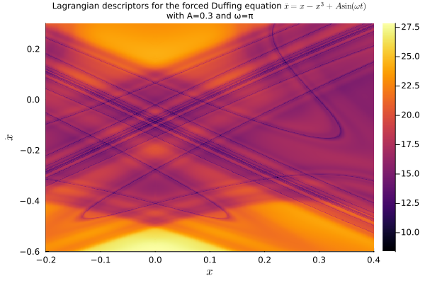
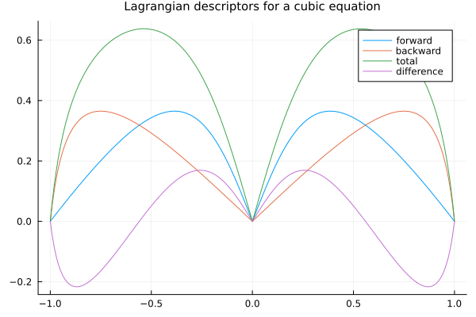

# Ordinary Differential Equations

We considere, here, some examples of applying the Lagragian descriptor method to equations of the type `ODEProblem`.

## Periodically-forced Duffing equation

We start with an application of the method of Lagrangian descriptors to the periodically-forced Duffing equation, as illustrated in [Painting the Phase Portrait of a Dynamical System with the Computational Tool of Lagrangian Descriptors](https://www.ams.org/journals/notices/202206/noti2489/noti2489.html?adat=June/July%202022&trk=2489&galt=none&cat=feature&pdfissue=202206&pdffile=rnoti-p936.pdf). The equation takes the form

```math
\ddot x = x - x^3 + A\sin(\omega t).
```

We write it as a system

```math
\begin{cases}
  \dot x = y, \\
  \dot y = x - x^3 + A\sin(\omega t).
\end{cases}
```

The idea is to set up this system as an `ODEProblem` from [SciML/DifferentialEquations.jl](https://github.com/SciML/DifferentialEquations.jl), then wrap it as a `LagrangianDescriptorProblem` from `LagrangianDescriptors.jl`, which we can then solve as an ensemble problem and plot the result.

So we first load the relevant packages:

```julia duffing
using OrdinaryDiffEq, Plots
using LinearAlgebra: norm
using LagrangianDescriptors
```

Next we set up the `ODEProblem`:

```julia duffing
function f!(du, u, p, t)
    x, y = u
    A, ω = p
    du[1] = y
    du[2] = x - x^3 + A * sin(ω * t)
end

u0 = [0.5, 2.2]
tspan = (0.0, 13.0)
A = 0.3; ω = π; p = (A, ω)

prob = ODEProblem(f!, u0, tspan, p)
```

With the ODE problem setup, we choose an infinitesimal Lagrangian descriptor, a collection of initial conditions on the phase space, which is the region to be "painted", and finally we build the `LagrangianDescriptorProblem`:

```julia duffing
M(du, u, p, t) = norm(du)

uu0 = [[x, y] for y in range(-1.0, 1.0, length=301), x in range(-1.8, 1.8, length=301)]

lagprob = LagrangianDescriptorProblem(prob, M, uu0)
```

The Lagrangian descriptors are the time-integration of the infinitesimal descriptor along forward and backward solutions of the equation. They are integrated along with the solutions by "solving" the `LagrangianDescriptorProblem`, with an overload of the `solve` method from the [SciML](https://sciml.ai) ecosystem:

```julia duffing
lagsol = solve(lagprob, Tsit5())
```

With the solution at hand, we plot the Lagrangian descriptors to visualize the dynamics of the system:

```julia duffing
plot(lagsol, title="Lagrangian descriptors for the forced Duffing equation \$\\ddot x = x - x^3 + A\\sin(\\omega t)\$\nwith A=$A and ω=$ω", titlefont=8, xlabel="\$x\$", ylabel="\$\\dot x\$")

savefig("img/duffing.png")
```


We may zoom closer to the origin to find the following "painting":

```julia duffing
uu0 = [[x, y] for y in range(-0.6, 0.3, length=601), x in range(-0.2, 0.4, length=401)]
lagprob = LagrangianDescriptorProblem(prob, M, uu0)

lagsol = solve(lagprob, Tsit5());

plot(lagsol, title="Lagrangian descriptors for the forced Duffing equation \$\\ddot x = x - x^3 + A\\sin(\\omega t)\$\nwith A=$A and ω=$ω", titlefont=8, xlabel="\$x\$", ylabel="\$\\dot x\$")

savefig("img/duffing2.png")
```



If we want to change parameters, we just `remake` the original `ODEProblem` (in the future I should add the option to remake the `LagrangianDescriptorProblem` itself.)

```julia
A = 2.0; ω = 2π; p = (A, ω);
prob = remake(prob, p=p)
uu0 = [[x, y] for y in range(-0.6, -0.1, length=501), x in range(-0.2, 0.3, length=401)]
lagprob = LagrangianDescriptorProblem(prob, M, uu0)

lagsol = solve(lagprob, Tsit5());

plot(lagsol, title="Lagrangian descriptors for the forced Duffing equation \$\\ddot x = x - x^3 + A\\sin(\\omega t)\$\nwith A=$A and ω=$ω", titlefont=8, xlabel="\$x\$", ylabel="\$\\dot x\$")

savefig("img/duffing3.png")
```


## Autonomous Duffing equation

For visualizing the autonomous case, we may rewrite the system or, since we already have the non-autonomous case implemented, we just set the amplitude of the forcing term to zero:

```julia
A = 0.0; ω = 2π; p = (A, ω);
prob = remake(prob, p=p)
uu0 = [[x, y] for y in range(-1.0, 1.0, length=301), x in range(-1.8, 1.8, length=301)]
lagprob = LagrangianDescriptorProblem(prob, M, uu0)

lagsol = solve(lagprob, Tsit5());

plot(lagsol, title="Lagrangian descriptors for the forced Duffing equation \$\\ddot x = x - x^3 + A\\sin(\\omega t)\$\nwith A=$A and ω=$ω", titlefont=8, xlabel="\$x\$", ylabel="\$\\dot x\$")

savefig("img/duffing4.png")
```


## A scalar cubic equation

Although one-dimensional problems are easier to understand, the method also works for such problems. Here we experiment with the scalar cubic equation

```math
   \frac{\mathrm{d}x}{\mathrm{d}t} = x - x^3
```

This equation has two stationary solutions, associated with the fixed points $x=0$ and $x=1$.

We setup the `ODEProblem`:

```julia
f(u, p, t) = u - u^3

u0 = 0.5
tspan = (0.0, 1.0)
prob = ODEProblem(f, u0, tspan, p)
```

Build the `LagrangianDescriptorProblem`:

```julia
M(du, u, p, t) = norm(du)
uu0 = range(-1.0, 1.0, length = 201)
lagprob = LagrangianDescriptorProblem(prob, M, uu0)
```

Solve it:

```julia
lagsol = solve(lagprob, Tsit5())
```

and plot it:

```julia
plot(
    uu0,
    lagsol(:forward),
    label = "forward",
    title = "Lagrangian descriptors for a cubic equation",
    titlefont = 10,
)
plot!(uu0, lagsol(:backward), label = "backward")
plot!(uu0, lagsol(), label = "total")
plot!(uu0, lagsol(:difference), label = "difference")

savefig("img/cubic.png")
```

In any of the Lagrangian descriptors (forward, backward, total, and difference) we distinguish the two fixed points.


